# TAREA FINAL PMDM.
## APLICACION ANDROID PARA GESTIONAR RESERVAS DE PASEOS A CABALLOS HACIENDO CRUD A TRAVES DE UNA API REST EN LARAVEL.

Esta es la segunda parte de la tarea final del curso. Consiste en crear una aplicación Android para gestionar los paseos a caballo reservados por un usuario. El usuario se podrá registar en el sistema y logearse. Una vez dentro podrá consultar la información de cada una de sus reservas, añadir nuevas, editar las existentes y borrar la que desee.

La aplicación está desarrollada en Android Studio Jellyfish, y hace uso de las siguientes tecnologías: 

- arquitectura MVVM
- ViewModel
- patrón repository
- patrón Singleton para la instancia de la API
- Navigation Component
- DiffUtil

como hemos mencionado se basa en una arquitectura MVVM, en la imagen podemos apreciar la distribución de clases que he adoptado para cumplir con este modelo.

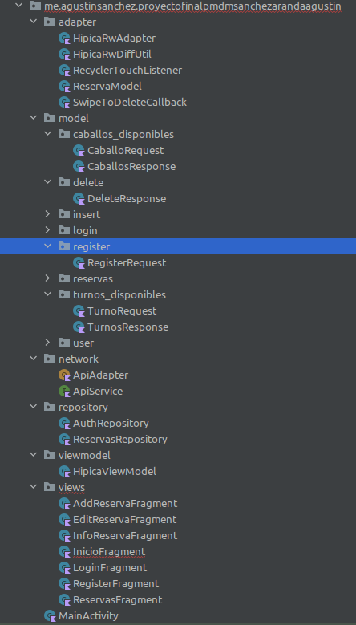

en adapter tenemos la implementación del RW que muestra las reservas, en model se modela todo lo que son respuestas y parámetros a la API, Network es la capa de acceso a la API, en repository se hace uso del patrón repositorio, usamos un ViewModel para comunicarnos con la UI, y para las distintas interfaces usamos fragments navegando entre ellos con navigation component como vemos en la siguiente imagen.

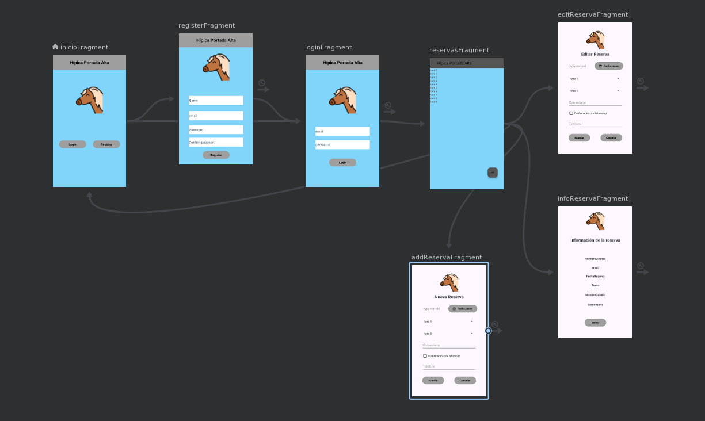

Al comenzar la aplicación tenemos una pantalla de bienvenida donde podemos elegir entre hacer login si ya somos usuarios o registrarnos.

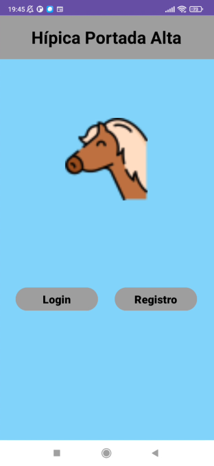 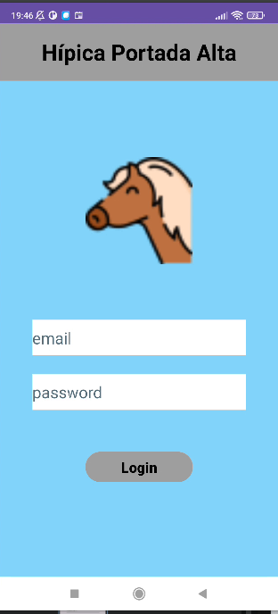 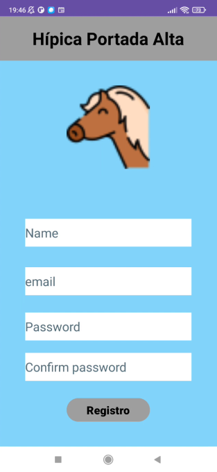

Al hacer login y registro usamos llamadas a la API con las credenciales y se nos devolverá un token, son las dos únicas llamadas que no tienen que estar autenticadas. Para todas las siguientes usaremos ese token.

Nota, al hacer registro, se nos mandará un email para confirmarlo, imprescindible para poder hacer luego login.

Al autentiarnos pasamos a ver un RW con todas nuestras reservas vigentes:

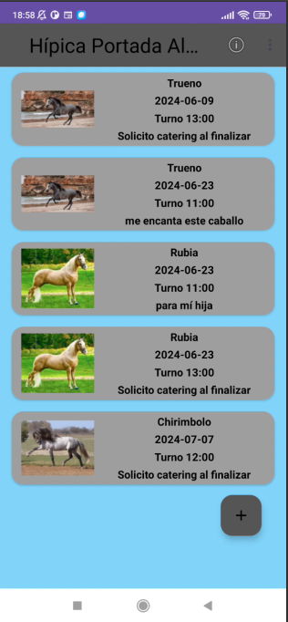 

podremos con el botón flotante de + agregar una nueva reserva, con una pulsación corta sobre un item podremos consultar toda su información, con una pulsación larga podremos editar dicho item, y con deslizamiento borramos la reserva.
Todas estas operaciones de crud se hacen con llamadas a la API, muestro capturas de los fragments que me permiten gestionar la inserción de reserva y la edición, así como la consulta de la información de la reserva.

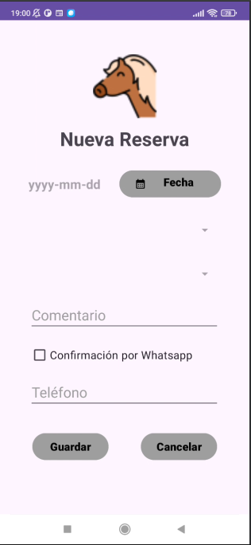 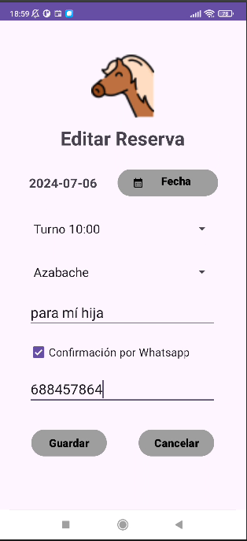 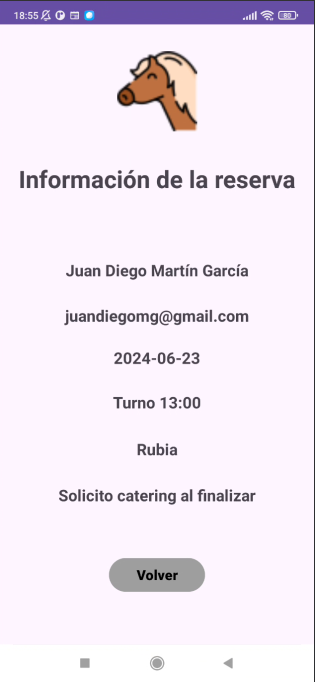

sobre la inserción de reserva y edición comentar que los spinner de turno y de caballos se van cargando dinamicamente según la disponibilidad de la fecha elegida. El datePicker sólo permitirá fines de semana desde la fecha actual hasta los treinta días siguientes. Cuando seleccionamos una fecha se recalculan los turnos libres para ese día y se muestran en el spinner de turno, al tener elegido el turno se recalcularán los caballos disponibles para esa hora y se mostrarán sólo los disponibles.

Al hacer una nueva reserva o editarla podemos mandar un wassap al numero deseado marcando el check de whatsapp, para que se envie hemos de tener un número de móvil español válido, sino no se enviará, el número es controlado con expresión regular.
No obstante se mandará un correo de confirmación al email de la cuenta.

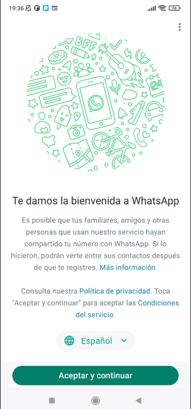

He controlado que no podamos salir de las reservas con el botón atrás para no volver a la pantalla de login con el usuario anterior activo en la aplicación, para volver a la pantalla principal hemos de hacer logout y nos desconectaremos del sistema a través de la API, volviendo a la pantalla de inicio.

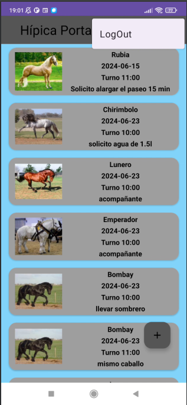 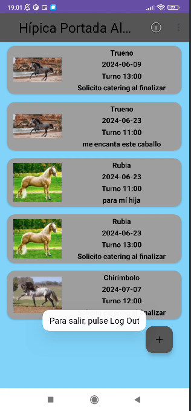

Este logout lo pongo en una ToolBar junto con un acercaDe

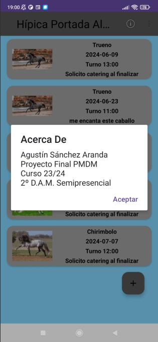

